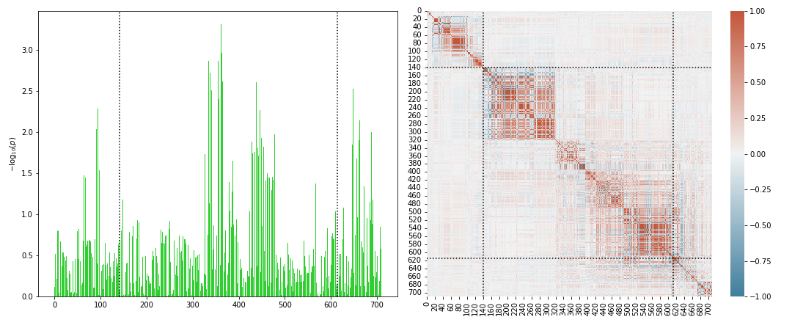
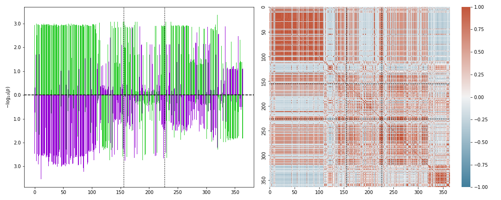

Usage
=====

PascalX can be used either via a command-line interface or as a python3 library. The latter unlocks the full potential of PascalX. 

Command-line interface
----------------------

The command-line interface is invoked by calling ``./pascalx``. Available options and settings can be displayed by executing

.. code-block:: console
    
    ./pascalx -h

Note that the script possesses global and command specific settings. The latter can be displayed after specifying the required global (positional) arguments and choice of command (``genescoring`` or ``xscoring``), for example

.. code-block:: console
    
    ./pascalx ensemble.txt demo/EUR.simulated out.txt genescoring -h

The first argument specifies the gene annotation file (will be downloaded automatically from ensembl biomart if the specified file does not exist). The second argument sets the reference panel to use (will be imported automatically from corresponding .vcf files if not imported yet). The third argument specifies the file to store results in, and the fourth argument sets the operation to perform (``genescoring`` or ``xscoring``).

Pathway scoring can be performed by prepending ``-pw`` followed by a file containing gene modules, for example

.. code-block:: console

   ./pascalx -pw pathways.txt ensemble.txt refpanel out.txt genescoring gwasA.tsv.gz 

For the parameters to specify the data columns in your pathway or GWAS file, please consult the ``-h`` option. 

.. note::

    The command line interface uses a saddle point approximation to evaluate CDFs. 

------

Gene scoring
------------

**Initialization:**

Import the genescorer class and initialize the sum of :math:`\chi^2` based gene scorer:

.. code-block:: python

    from PascalX import genescorer

    Scorer = genescorer.chi2sum()

Note that the default options of the genescorer are used. In particular, the gene start and end positions are extended by a window of ``window=50000`` and the variance cutoff is set to ``varcutoff=0.99``.  

**Reference panel:**

`1000 Genome Project <https://www.internationalgenome.org/data>`_ reference data can be downloaded and converted via executing the script in the ``PascalX/misc`` folder as below (for GRCh37 replace 38 with 37). 

.. code-block:: console

    bash get1KGGRCh38.sh pathtostore/ EUR 4 tped

The third parameter specifies the # of cpu cores to utilize. The plink converted files will be stored in the ``pathtostore/`` folder and will be named ``EUR.1KG.GRCh38.chr#``. If you want to retain samples of all origin, replace ``EUR`` with ``ALL``. Note that execution of the script requires a Linux OS. For instance, you can run it in the PascalX :ref:`DockerSec` runtime.

Set the reference panel to use via

.. code-block:: python
    
    Scorer.load_refpanel('path/EUR.1KG.GRCh38',keepfile=None)

.. note::

    If the corresponding reference data has not been imported yet, PascalX will try to import the data from ``filename.chr#.tped.gz`` or ``filename.chr#.vcf.gz`` files in ``path/``. For .tped files the genotype information has to be supplied in gzip compressed 1-2-coded plink tped files. The following `plink <https://www.cog-genomics.org/plink/>`_ options should do the job: ``--recode 12 transpose``. By default PascalX will utilize only one cpu core for the import. You can increase the number of cores used via setting the ``parallel=`` option. 
    
.. warning::

    In order to import allele information into the reference panel, raw .vcf files have to be used for the import. Replace for this the ``tped`` import script option above with ``vcf``. Note that to keep only a subset of samples under .vcf import, the ``keepfile=`` option has to be set.   

.. note::
    
    The 1KG data download for GRCh38 is around 50GB. The import can take more than an hour per chromosome. A high parallel setting is therefore recommended.

**Gene annotation:**

If you want to use ensembl gene annotation, it can be automatically downloaded from `BioMart <https://www.ensembl.org/biomart/martview/>`_ as follows.

.. code-block:: python

    from PascalX.genome import genome
    
    G = genome()
    G.get_ensembl_annotation('your_filename.tsv',genetype='protein_coding, lncRNA',version='GRCh38')

In the ``genetype=`` option all valid ensembl gene types can be supplied as a comma separated string.

.. warning::

    PascalX matches genes with variant ids via position overlap in the loaded reference panel. Both datasets need to be based on the same annotation version (for instance both GRCh38) !

The downloaded annotation can be imported via

.. code-block:: python

    Scorer.load_genome('path/filename')

It is also possible to load your own annotation. Please refer to the :ref:`Genescorer` API documentation for the required options to set. Instead of using a position wise annotation, a direct SNP to gene mapping can be used instead via the ``load_mapping`` method.

**GWAS summary statistics:**

The GWAS summary statistics to score can be imported via

.. code-block:: python

    Scorer.load_GWAS('path/filename',rscol=0,pcol=1,a1col=None,a2col=None,header=False)

The argument ``rscol=`` specifies the column of the variant id and ``pcol=`` the column of the p-value. The columns ``a1col=`` and ``a2col=`` contain the alternate, respectively, reference allele. If the refernce panel does not contain allele information (.tped import), set both to ``None``. ``header=`` specifies if the first row is a header or not. The file can be either raw text or gzip compressed with file name ending on ``.gz``.

Note that the loaded GWAS SNPs can be visualized gene-wise via the command

.. code-block:: python

    Scorer.plot_genesnps('AOAH',mark_window=True,show_correlation=True);

**Scoring:**

After the gene annotation, reference panel and GWAS has been loaded as described above, gene scores can be calculated as follows.

*Example 1:*

Score all genes in the loaded annotation:

.. code-block:: python

    R = Scorer.score_all()

*Example 2:*

Score only genes on chromosomes 21 and 22:

.. code-block:: python
    
    R = Scorer.score_chr(chrs=[21,22])

*Example 3:*

Score the genes WDR12 and FARP2:

.. code-block:: python
    
    R = Scorer.score(['WDR12','FARP2'])

.. note::
    
    For all available options, please refer to the :ref:`Genescorer` section in the API documentation.

**Return:**

The return ``R`` of the gene scorer reads

.. code-block:: python
    
    R = [R_SUCCESS,R_FAIL,R_TOTALFAIL]
    
with

.. code-block:: python

    R_SUCCESS   = [ ['Symbol',p-value,NSNP],...]
    R_FAIL      = [ ['Symbol',[infos]]     ,...]   
    R_TOTALFAIL = [ ['Symbol','Reason']    ,...]
    
Here, ``R_SUCCESS`` is the list of successfully scored genes, ``R_FAIL`` the list of genes with failed scoring due to non-convergence of the scoring algorithm and ``R_TOTALFAIL`` the list of genes which failed for other reasons, like no available SNPs. 

By default, the genescorer uses a saddle-point approximation for CDF calculation (``method='saddle'``). For exact calculation, it is recommended to automatically select the most suitable algorithm and precision to use via using (``method='auto'``). The genes in ``R_FAIL`` can be automatically re-scored once (``autorescore=True``) using Pearson's algorithm. Note that Ruben at max precision, given enough iterations, will converge eventually. However, if the ratio between largest and smallest eigenvalue is large, it may converge very slowly. In this case, often it is helpful to reduce the kept variance via the ``varcutoff=`` parameter of the genescorer. Note that a result ``R`` can be manually re-scored using the rescore method of the :ref:`Genescorer`.

**Persistence:**

Use pickle to store ``R`` or 

.. code-block:: python

    Scorer.save_scores('filename')
    
to save only the gene symbol - p-value pairs in a tab separated text file.

**Visualization:**

A Manhattan plot for the scored genes can be generated automatically.

.. code-block:: python

    Scorer.plot_Manhattan(R[0])

.. image:: manhattanplot.png

For all plot options, please consult the :ref:`Genescorer` documentation. Note that the plot is generated via `matplotlib <https://matplotlib.org/>`_. The general plot can be modified or saved via accessing the current ``matplotlib.pyplot`` object. 

_______________________

Pathway scoring
---------------

PascalX offers two different pathway scorers. Both require a fully initialized genescorer, as introduced above.

**Initialization:**

Define a gene scorer and score or load scored genes for a GWAS. Note that saved genescores can be imported via

.. code-block:: python

    Scorer.load_scores('filename')

The pathway scorer is then initialiazed as follows.

Import first the pathway scoring class via

.. code-block:: python

    from PascalX import pathway

*Rank based scoring:*

.. code-block:: python

    Pscorer = pathway.chi2rank(Scorer)

The rank scorer uniformizes the gene p-value distribution via ranking and aggregates p-values via inverse transform to :math:`\chi^2` distributed random variables.

*Monte-Carlo based scoring:*

.. code-block:: python

    Pscorer = pathway.chi2perm(Scorer)

Gene p-values are directly :math:`\chi^2` inverse transformed and the sum for a given pathway is compared against randomly generated gene sets of equal size.

.. warning::
    Genes in the randomly generated gene sets are not fused due to computational cost. In general, we recommend to use soley the rank based scoring method.

**Modules:**

Sets of gene modules / pathways can be loaded from a tab-separated file via the command 

.. code-block:: python

    M = Pscorer.load_modules('filename.tsv',ncol=0,fcol=2)

``ncol=`` is the column with the name of the module and ``fcol=`` the first column with a gene symbol. It is assumed that other member genes follow in subsequent columns. 

**Scoring:**

.. code-block:: python

    RESULT = Pscorer.score(M)

The return ``RESULT`` reads

.. code-block:: python
    
    RESULT = [ ['name',[genes],[gene p-values],p-value],...]

Genes and meta-genes with out a p-value (failed gene scoring) are removed from the pathway before pathway scoring. These genes are marked in ``RESULT`` via ``NaN`` gene p-value.
    

_______________________

X scoring
----------

PascalX offers the two different GWAS cross scorers introduced in the preprint `doi:10.1101/2021.05.16.21257289 <https://doi.org/10.1101/2021.05.16.21257289>`_.

.. warning:: 

    Gene-wise cross scoring is a new feature which has not been peer-reviewed yet.

**Coherence scorer:**

.. code-block:: python
    
    from PascalX import xscorer

    X = xscorer.zsum(leftTail=False)
    X.load_genome('path/filename')

Note that the default initialization of the gene scoring above are used. ``leftTail=`` sets the side to test. ``False`` corresponds to anti-coherence and ``True`` to coherence.
A gene annotation has to be loaded as for the standard :ref:`Genescorer`.

.. code-block:: python

    X.load_GWAS('path/filenameA',name='GWAS A',rscol=0,pcol=1,bcol=2,a1col=None,a2col=None,header=False)
    X.load_GWAS('path/filenameB',name='GWAS B',rscol=0,pcol=1,bcol=2,a1col=None,a2col=None,header=False)

In the GWAS data loading routine, we have to set in addition a name for each GWAS to be loaded via the ``name=`` argument, and it is necessary to specify the column with the raw betas ``bcol=``.

.. warning::
    It is recommended to load allele information via setting ``a1col=`` and ``a2col=``. Note that this requires also a reference panel with allele information (.vcf import). 

It is recommended to filter for matching alleles between the GWAS via

.. code-block:: python

    X.matchAlleles('GWAS A','GWAS B')

and to perform the scoring for jointly QQ normalized p-values: 

.. code-block:: python
   
    X.jointlyRank('GWAS A','GWAS B')

The scoring is started via calling

.. code-block:: python
    
    R = X.score_all(E_A='GWAS A',E_B='GWAS B')

The return ``R`` is as for the :ref:`Genescorer` class.

Note that the loaded SNPs of a GWAS pair can be visualized gene-wise via the command

.. code-block:: python
    
    X.plot_genesnps('TRIM26','GWAS A','GWAS B',mark_window=True,show_correlation=True);
    

    
    
    
**Ratio scorer:**

As above, but with 

.. code-block:: python
   
    X = xscorer.rsum(leftTail=False)

_______________________

Tissue scoring
---------------

.. warning::

    Tissue enrichment scoring using the Pascal methodology is experimental and has not been peer-reviewed yet.

**Initialization:**

.. code-block:: python

    from PascalX.genexpr import genexpr
    
    GE = genexpr()
    GE.load_genome('yourannotationfile')

`GTEx <https://gtexportal.org/home/>`_ data has to be imported. For automatic import, call

.. code-block:: python

    GE.get_GTEX_expr('yourGTEXfilename')

.. note:: 
    The import of the raw data can take several hours. However, this step needs to be done only once and can be skipped in subsequent usage. 

After the GTEx data has been successfully imported, it can be loaded via

.. code-block:: python
    
    GE.load_expr('GTEX/yourGTEXfilename')

**Visualization:**

Tissue expression (in TPM) can be visualized for a list of genes via

.. code-block:: python

    GE.plot_genexpr(['AOAH','CSMD1','CDH13'],tzscore=True,cbar_pos=(0.0, 0.1, 0.01, 0.5))

.. image:: tissuevisu.png

**Scoring:**

PascalX tests for tissue enrichment in a similar fashion to the pathway scoring. The enrichment test is performed on a list of genes. Genes in close proximity are fused to meta-genes and TPM values are re-computed for the meta-genes from the raw GTEx read counts. The gene TPM values are uniformized via ranking and transformed to :math:`\chi^2` distributed random variables via the inverse :math:`\chi^2` cdf. The sum is tested against a :math:`\chi^2` distribution with :math:`n` (# genes) degrees of freedom. 

To test for enrichment of a pathway, supply the gene members. To test for GWAS enrichment, supply a list of the significant genes. 

.. code-block:: python

    R = GE.chi2rank([ ['PathwayName',['AOAH','CSMD1',' CDH13'] ] ])

**Return:**

.. code-block:: python

    R = ({'PathwayName': {'Tissue': pval,... },...  }, FAILS, GENES, [{'Tissue': [pvalg1,...]}]  )

with ``FAILS`` the list of (meta)-genes without TPM value, ``GENES`` the list of genes after fusion, and the last list of dictionaries listsing the individual gene inverse cdf transformed values.

.. toctree:
    :maxdepth: 2
    
_______________________

SNP-gene scoring
-----------------

PascalX supports external SNP-gene base information, such as eQTLs or chromatin interaction datasets, to complement the default distance based SNP-gene association. This requires external datasets containing rsids (variant id) and the gene Ensembl id they are associated with.

**Initialization:**

First, as for standard gene scoring, the genescorer has to be initialized and reference panel, ensembl gene annotation and GWAS SNPs have to be loaded.

.. code-block:: python

    from PascalX import genescorer

    Scorer = genescorer.chi2sum()
    Scorer.load_refpanel("path/filename")
    Scorer.load_genome("path/filename")

    Scorer.load_GWAS("path/filename",rscol=0,pcol=1,header=False)

**Importing the external SNP-gene datasets:**

The additional external SNP-gene annotation can be loaded via

.. code-block:: python

    Scorer.load_mapping("path/filename", rcol=0, gcol=1, delimiter=',', header=True, joint=True)

The arguments ``rscol=`` and ``gcol=`` specify, respectively, the columns of the SNP rsid and the ensembl gene id. The ``header=`` specifies if the first row is a header or not. The ``joint=`` argument is used to select if the gene and pathway scoring is done using only the external SNPs (False) or if it should also include the SNPs in the windowed gene transcription side (True). The SNP-gene information file can either be a raw text file or a gzip compressed file (with ending .gz).

**Scoring:**

The gene and pathway scoring can then be executed as for standard gene scoring:

*Gene scoring:*

.. code-block:: python

    R = Scorer.score_all()

*Pathway scoring:*

.. code-block:: python

    from PascalX import pathway

    Pscorer = pathway.chi2rank(Scorer)
    M = Pscorer.load_modules("filename.tsv",ncol=0,fcol=2)

    RESULT = Pscorer.score(M)
